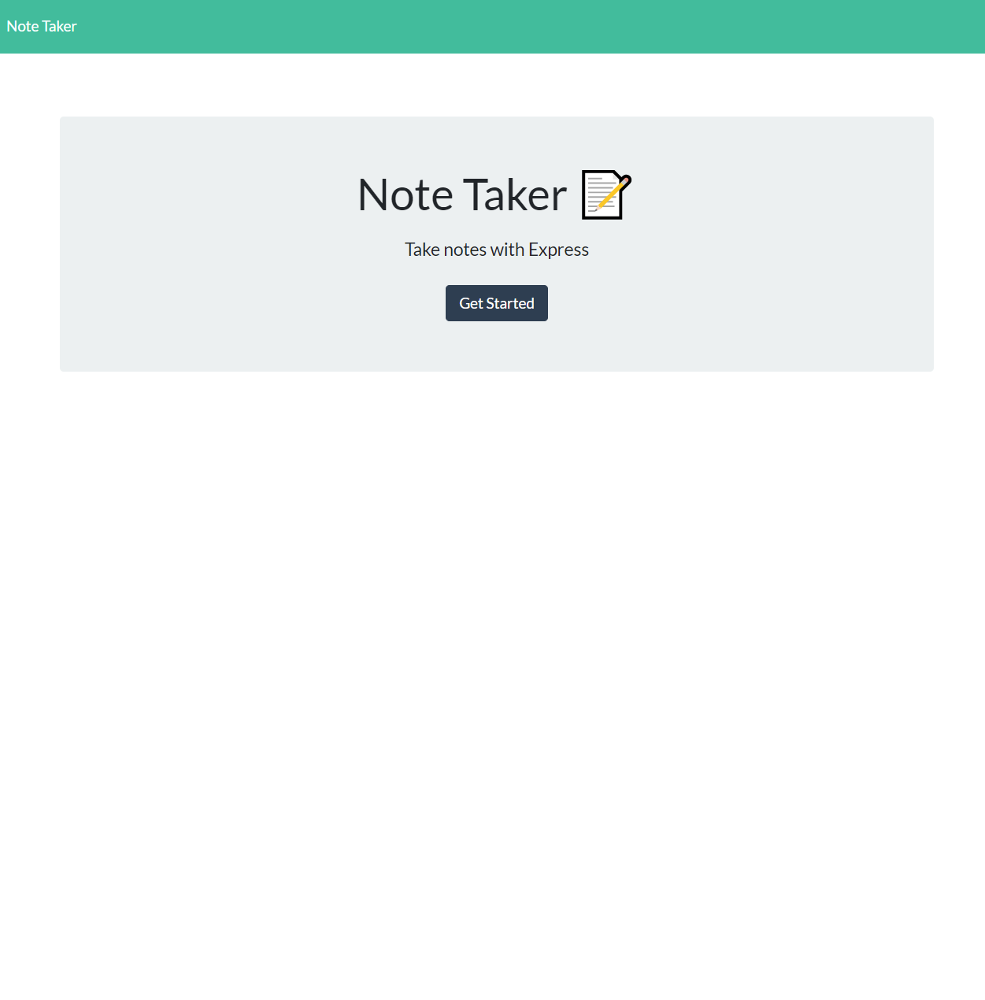
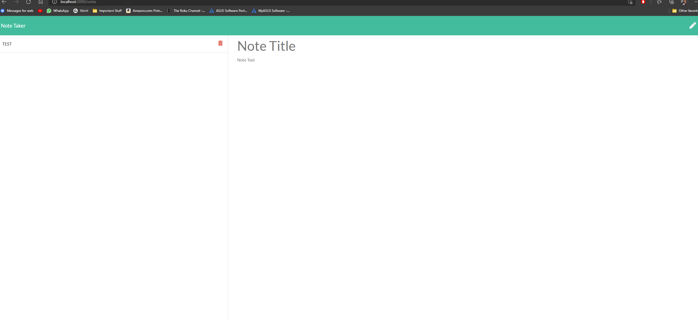

# Note Taker


## Description

This is an exercise in writing and reading notes from the server. 

## Table of Contents 

* [Installation](#installation)

* [Usage](#usage)

* [License](#license)

* [Contributing](#contributing)

* [Tests](#tests)

* [Questions](#questions)

## Installation

To install necessary dependencies, run the following command:

```
npm i
```
## Contributing


## Usage


## License

This project is licensed under the MIT license.
  

## Tests

To run tests, run the following command:

```
npm test
```

## Questions

If you have any questions. Feel free to contact me at: mliemann@live.com. Find more of my work here:  [mliemann](https://github.com/mliemann/).

## Pictures



## Links
Github Repo: https://github.com/mliemann/-NoteTaker
Deployed Link Github: https://mliemann.github.io/-NoteTaker/
Heroku: https://radiant-tundra-37753.herokuapp.com/